# Retail Data Engineering Pipeline with RFM Customer Segmentation

An end-to-end data engineering pipeline that extracts retail data from a public API, transforms and loads it into a relational database, performs RFM (Recency, Frequency, Monetary) customer segmentation using SQL window functions, and visualises insights through an EDA notebook and Power BI dashboard.

---

## Architecture



**Pipeline flow:**
```
DummyJSON API → Python (extract.py) → Raw JSON → Python (transform.py) → 4 Clean CSVs → SQLite (load.py) → SQL RFM Analysis → Power BI Dashboard
                                                                                                            ↓
                                                                                              EDA Notebook (eda.ipynb)
```

---

## Tech Stack

| Layer | Tool / Technology |
|---|---|
| Data Source | [DummyJSON API](https://dummyjson.com) |
| Extraction | Python (requests, json, os, datetime) |
| Transformation | Python (pandas) |
| Storage | SQLite (`retail_pipeline.db`) |
| Analysis | SQL — CTEs, NTILE(5) window function |
| Exploratory Analysis | Python (pandas, matplotlib, seaborn) |
| Visualisation | Power BI Desktop |

---

## Project Structure

```
retail-de-pipeline/
├── data/
│   ├── raw/                    → 3 timestamped JSON files (products, users, carts)
│   └── processed/              → 4 clean CSVs (products, users, carts, customer_summary)
├── scripts/
│   ├── extract.py              → Pulls data from DummyJSON API, saves timestamped JSONs
│   ├── transform.py            → Flattens nested carts, validates nulls, produces 4 CSVs
│   └── load.py                 → Loads all 4 CSVs into SQLite (retail_pipeline.db)
├── sql/
│   └── rfm_queries.sql         → 5 queries: RFM scoring, NTILE segmentation, segment summary
├── notebooks/
│   └── eda.ipynb               → 13 charts with business interpretations
├── dashboard/
│   └── Retail_Customer_Segmentation_Dashboard.pbix
├── docs/
│   ├── business_insights.md    → Segment-level business recommendations
│   └── stakeholder_ppt.pptx    → Executive summary slide deck
├── architecture_diagram.png    → Visual pipeline architecture
└── README.md
```

---

## How to Run

### Prerequisites

```bash
pip install requests pandas
```

No additional database setup needed — SQLite is part of Python's standard library.

### Step 1 — Extract

```bash
python scripts/extract.py
```

Pulls products, users, and carts from the DummyJSON API and saves timestamped JSON files to `data/raw/`.

### Step 2 — Transform

```bash
python scripts/transform.py
```

- Flattens nested cart line items (50 carts → 198 cart line items)
- Validates and drops nulls
- Outputs 4 clean CSVs to `data/processed/`

### Step 3 — Load

```bash
python scripts/load.py
```

Loads all 4 CSVs into `retail_pipeline.db` (SQLite). Tables created: `products`, `users`, `carts`, `customer_summary`.

### Step 4 — Run RFM Queries

Open `sql/rfm_queries.sql` in any SQLite-compatible client (DB Browser for SQLite, DBeaver, etc.) and run against `retail_pipeline.db`.

### Step 5 — View the Dashboard

Open `dashboard/Retail_Customer_Segmentation_Dashboard.pbix` in Power BI Desktop.

---

## Key Outputs

### RFM Segmentation Results

| Segment | Customers | Total Revenue |
|---|---|---|
| Champions | 7 | ₹7,43,122 |
| Loyal Customers | 11 | ₹1,68,798 |
| At Risk | 21 | ₹89,876 |
| Lost Customers | 6 | ₹2,472 |
| **Total** | **45** | **~₹10.04 L** |

**Key finding:** Champions (15% of customers) account for approximately 74% of total revenue — a classic Pareto distribution that has direct implications for retention strategy.

### EDA Notebook

13 charts covering revenue distribution, segment-level spending patterns, product category performance, discount impact analysis, and customer purchase frequency.

---

## Design Decisions

### Why SQLite?
This is a portfolio/analytical pipeline for a dataset of ~200 rows. SQLite is lightweight, requires zero infrastructure setup, and is sufficient for single-user analytical workloads. In a production setting, this would be replaced with PostgreSQL or a cloud data warehouse (BigQuery, Redshift, Snowflake) depending on scale and team access patterns.

### Why NTILE(5) for RFM?
`NTILE(5)` is a SQL window function that distributes rows into 5 equal-ranked buckets. It is declarative, reproducible, and does not require hardcoded thresholds — making it suitable for datasets of varying size. A separate Python implementation using `pd.qcut()` + score thresholds was built in the EDA notebook for comparison; minor count differences between both approaches are expected and both are valid.

### Recency proxy — honest limitation
DummyJSON is a mock API and does not include real purchase dates. `max_cart_id` was used as a recency proxy (higher cart ID ≈ more recent activity). This is a known limitation acknowledged throughout the project. In a production pipeline, this would be replaced by a proper `last_purchase_date` timestamp.

---

## Limitations and Production Considerations

| Limitation | Production Alternative |
|---|---|
| Mock data, no real dates | Replace recency proxy with actual `transaction_date` |
| SQLite (single-user, no concurrency) | PostgreSQL / cloud DWH for multi-user access |
| Manual pipeline execution | Apache Airflow or AWS Step Functions for orchestration |
| Static API (DummyJSON) | Live retail transaction feed or streaming source |
| Local Power BI file | Power BI Service for shared, refreshable dashboards |

---

## Author

**Shreeya Mannuru**
B.E. Computer Science and Engineering — Rajalakshmi Engineering College (2025)
[GitHub](https://github.com/Shreeya-Mannuru/retail_data_eng_pipeline)